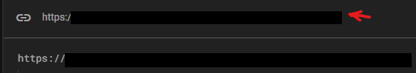
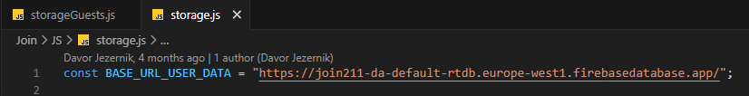
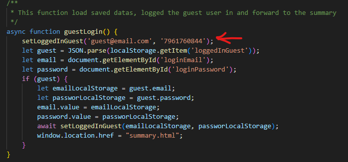

# 🚀 Web App with JavaScript, HTML, CSS & Firebase

## 🛠️ Setup Guide

### 1. Clone the Repository
```bash
git clone https://github.com/davorjezernik/Join.git
cd Join
```

### 2. Create a new Firebase project
1. Set a name for the project
2. AI assistant off
3. Google Analytics off

### 3. Make a Realtime Database


1.Chose the nearest server
2.Use test mode
U will get an url from it like this:





### 4. Setup base_url
Changee the BASE_URL_USER_DATA in storageGuests.js and storage.js

This one:





To the new one from Firebase from step 3


### 4. Register
Guest register:





Use the data from the codebase 

For other users just what you want

To users will apear in firebase:


Done!

